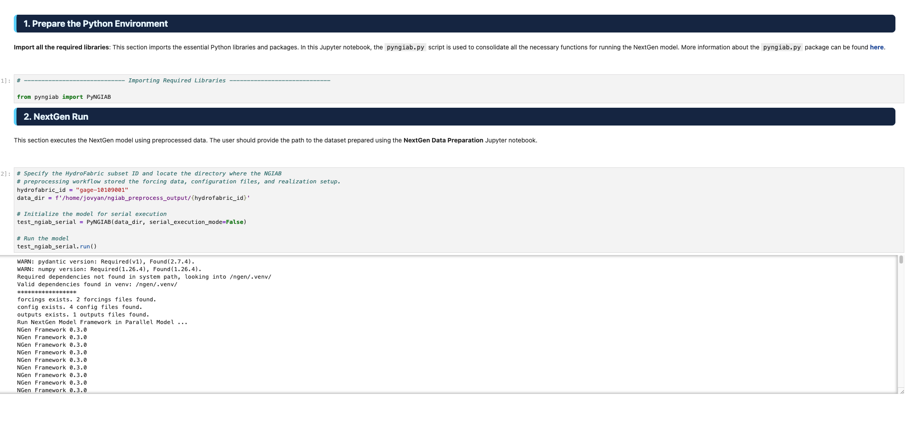

# Four ways to run NextGen in a Box (NGIAB)

Before starting this section, make sure you have `uv` installed, and make sure you have cloned the NGIAB-CloudInfra and DataStreamCLI repositories. See our [Before the Workshop](before-the-workshop.md) guide for instructions.

## Data Preprocessor

The NGIAB Data Preprocessor has a built-in function to run NGIAB. This is convenient, but does not allow you to modify any of the preprocessed data files before the run starts.

```bash
uvx --from ngiab-prep cli -i gage-02342500 -sfr --start 2020-01-01 --end 2020-01-07 --source aorc --run
```


In this command, `uvx` allows for you to run the data preprocessor without installing it as a package. `-i gage-02342500` selects USGS gage 02342500 as the location to be modeled. `-s` **s**ubsets the NextGen hydrofabric geopackage, `-f` generates **f**orcings, `-r` generates **r**ealization and BMI configuration files, `--start` and `--end` specify the start and end dates of the simulation, `--source` specifies the source of raw forcing data, and `--run` indicates that a Docker image containing NGIAB should be spun up after the data has been preprocessed, and a NextGen simulation should be automatically run with the data.

For more information on the data preprocessor and its functionalities, see the [documentation](https://github.com/CIROH-UA/NGIAB_data_preprocess).

## Data Preprocessor + Guide Script

This method allows you to preprocess data and run NGIAB as separate steps. The guide script in the NGIAB-CloudInfra repository walks you through the NGIAB run and gives you the option to evaluate your results using TEEHR and visualize the results using the Tethys visualizer.

```bash
cd /path/to/NGIAB-CloudInfra
uvx --from ngiab-prep cli -i gage-02342500 -sfr --start 2020-01-01 --end 2020-01-07 --source aorc
chmod +x guide.sh
./guide.sh
# Podman users: ./guide.sh -p
```


## CCNH in JupyterHub

Please follow the instructions in the [HydroShare resource](https://www.hydroshare.org/resource/27045581bdea4808a393330f2417379c/). Running NGIAB in CCNH allows you to bypass any setup steps and run the simulation in the cloud.



## DataStreamCLI

You can run NGIAB locally through DataStreamCLI. We will subset the hydrofabric using the Data Preprocessor and then use that to run DataStreamCLI.

```bash
uvx --from ngiab-prep cli -i gage-02342500 -s
cd /path/to/datastreamcli
cp ~/ngiab_preprocess_output/gage-02342500/config/gage-02342500_subset.gpkg .
chmod +x ./scripts/datastream
./scripts/datastream -s 202006200100 \
                    -e 202006210000 \
                    -C NWM_RETRO_V3 \
                    -d $(pwd)/data/datastream_test \
                    -g $(pwd)/gage-02342500_subset.gpkg \
                    -R $(pwd)/configs/ngen/realization_sloth_nom_cfe_pet_troute.json \
                    -n 4
```


`-s` indicates the **s**tart date and time, `-e` indicates the **e**nd date and time, `-C` indicates the forcing sour**c**e, `-d` indicates the output **d**irectory, `-g` indicates the **g**eopackage, `-R` indicates the **r**ealization template, and `-n` indicates the **n**umber of processes.

Note that DataStreamCLI internally processes forcings and generates realizations and BMI configuration files for you, as well as automatically queuing up a NextGen simulation.